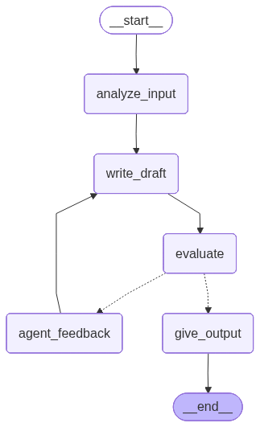

# 범용 프롬프트 생성기

A web-based prompt generator powered by **LangGraph** and **Upstage Solar**. Input a rough idea and the AI produces a structured, high-quality 6-section prompt through an automated analysis → draft → evaluate → feedback loop.

**Live Demo**: https://promptgeneratorlanggraph-production.up.railway.app



## Features

- **Split-panel UI** — conversation on the left, generated prompt on the right
- **Per-user API key** — each user enters their own Upstage API key; nothing is stored server-side
- **Real-time progress** — live step indicators as the graph executes
- **5-node LangGraph pipeline** — Analyze → Draft → Evaluate → Feedback → Output
- **One-click copy** — copy the final prompt to clipboard instantly

## How It Works

```
User Input
    │
    ▼
analyze_input  →  write_draft  →  evaluate
                      ▲               │
                      │         needs_improvement
                 agent_feedback        │
                                       ▼ good
                                  give_output
```

1. **analyze_input** — identifies missing information from the user's request
2. **write_draft** — generates a 6-section structured prompt
3. **evaluate** — scores the draft quality (good / needs_improvement)
4. **agent_feedback** — provides revision notes if quality is insufficient
5. **give_output** — delivers the final polished prompt

### 6-Section Prompt Template

| # | Section | Description |
|---|---------|-------------|
| 1 | 역할 (Role) | The AI's role and persona |
| 2 | 배경 정보 (Background) | Relevant context |
| 3 | 수행 과제 (Task) | What the AI must do |
| 4 | 제약 사항 (Constraints) | Rules and limitations |
| 5 | 세부 지시 (Instructions) | Step-by-step guidance |
| 6 | 출력 형식 (Output Format) | Expected output structure |

## Tech Stack

| Layer | Technology |
|-------|-----------|
| LLM | Upstage Solar Pro (`solar-pro`) |
| Agent framework | LangGraph |
| Backend | FastAPI + WebSocket |
| Frontend | Vanilla HTML / CSS / JS |
| Deployment | Docker + Railway |

## How to Use

1. **접속** — [https://promptgeneratorlanggraph-production.up.railway.app](https://promptgeneratorlanggraph-production.up.railway.app) 에 접속합니다. (로컬 실행 시 `http://localhost:8000`)
2. **API Key 입력** — 팝업 모달에 본인의 [Upstage API Key](https://console.upstage.ai)를 입력하고 **Confirm** 을 누릅니다.
3. **아이디어 입력** — 왼쪽 채팅창에 만들고 싶은 프롬프트의 아이디어를 자유롭게 입력합니다.
4. **진행 상황 확인** — AI가 분석 → 초안 작성 → 평가 → 피드백 단계를 거치는 동안 실시간 진행 표시기가 나타납니다.
5. **결과 확인 및 복사** — 오른쪽 패널에 완성된 6섹션 구조 프롬프트가 표시됩니다. **Copy** 버튼으로 클립보드에 복사하세요.

> API Key는 브라우저 세션에만 유지되며 서버에 저장되지 않습니다.

## Developer Guide

### Prerequisites

- Python 3.11+
- [uv](https://docs.astral.sh/uv/) (recommended) or pip
- Upstage API key — get one at [console.upstage.ai](https://console.upstage.ai)

### Local Setup

```bash
# Clone the repository
git clone https://github.com/SeMinKong/langgraph.git
cd langgraph

# Install dependencies
uv pip install -r requirements.txt

# Run the development server
uv run uvicorn server.app:app --reload
```

Open `http://localhost:8000`, enter your Upstage API key, and start generating prompts.

### Environment Variable (optional)

To skip the API key modal during local dev, create a `.env` file:

```
UPSTAGE_API_KEY=your_key_here
```

### Deployment on Railway

1. Push this repo to GitHub
2. Go to [railway.app](https://railway.app) → **New Project** → **Deploy from GitHub repo**
3. Select this repository — Railway auto-detects the `Dockerfile`
4. Go to **Settings → Networking → Generate Domain**
5. Share the public URL with your team

No environment variables needed — each user provides their own API key via the UI.

## Project Structure

```
├── state.py              # LangGraph state definition
├── nodes.py              # Node functions (analyze, draft, evaluate, feedback, output)
├── graph.py              # Graph topology and conditional routing
├── main.py               # CLI entry point
├── server/
│   ├── app.py            # FastAPI app, routes, WebSocket endpoint
│   ├── session.py        # In-memory session store
│   ├── graph_runner.py   # Async graph execution with real-time streaming
│   └── ws_handler.py     # WebSocket message helpers
├── frontend/
│   ├── index.html        # Split-panel UI + API key modal
│   ├── style.css         # Light theme, minimal design
│   └── app.js            # WebSocket client, progress tracking
├── requirements.txt      # All dependencies
└── Dockerfile            # For Railway / Docker deployment
```

## License

MIT
